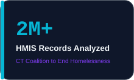
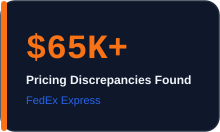
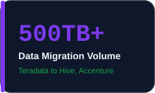

<!--
  SETUP
  This file goes in a repo named exactly "nehalipp/nehalipp".

  Assets (place in an "assets" folder in the same repo):
    assets/stat-years.svg
    assets/stat-hmis.svg
    assets/stat-pricing.svg
    assets/stat-migration.svg
    assets/trend-hero.svg
    assets/tech-frequency.svg
    assets/Nehali_Parulekar_Resume.pdf
-->

 

  

  

  

  <a href="#about-me">About</a> ·
  <a href="#analytics-at-a-glance">Numbers</a> ·
  <a href="#core-stack">Stack</a> ·
  <a href="#professional-experience">Experience</a> ·
  <a href="#featured-projects">Projects</a> ·
  <a href="#education">Education</a> ·
  <a href="#certifications">Certifications</a> ·
  <a href="#leadership--extracurricular">Leadership</a>

---

<table>
<tr>
<td>

# 👋 About Me

I'm a **Data & BI Analyst with 5+ years of experience** working across logistics, finance, nonprofit, consulting, and higher education.

My work focuses on turning business questions into **reliable data, SQL analysis, clear dashboards, and actionable insights**.

I work primarily with **SQL, Power BI, Tableau, Excel, PostgreSQL, and Python**, with particular strength in **data quality, KPI reporting, dashboard development, data validation, and stakeholder collaboration**.

</td>
</tr>
</table>

 

 
A visual note, not a literal metric.

 

🔭 **Building:** Project Atlas — a PostgreSQL data warehouse and BI portfolio  
🌱 **Learning:** Microsoft Power BI Data Analyst Associate (PL-300)  
🎯 **Seeking:** Data Analyst · Senior Data Analyst · BI Analyst opportunities  
📍 **Based in:** Dover, Pennsylvania  

---

# 📈 Analytics at a Glance

 

---

# 🛠️ Core Stack

## 📊 Business Intelligence

     

## 🗄️ Databases & SQL

    

## 🐍 Analytics & Data Engineering

     

---

# 📊 Top 5 Tools by Frequency

Counted across all 6 roles and 3 projects below. SQL, Tableau, Python, and Excel are clear leaders; Power BI ties with PostgreSQL, Oracle, and Teradata at 2 mentions each — shown here since it lines up with the BI-analyst roles I'm targeting.

  

 

---

# 💼 Professional Experience

### 🔵 Data Analyst — FedEx Express

**Transportation & Supply Chain Services · Mumbai, India**
**Feb 2025 – Nov 2025**

Used SQL and Power BI to identify $65K+ in pricing discrepancies, built KPI dashboards with DAX and Row-Level Security, and supported recurring reporting for U.S. stakeholders.

**SQL** · **Power BI** · **DAX** · **RLS** · **Oracle** · **Teradata**

---

### 🟣 Quant / Data Analyst — Equentis

**Wealth Advisory Services · Mumbai, India**
**Jun 2024 – Jan 2025**

Cleaned and analyzed business and financial data in SQL and Excel to support investment research and wealth advisory analysis.

**SQL** · **Excel** · **Investment Research**

---

### 🟠 Senior Data Analyst — Connecticut Coalition to End Homelessness

**Hartford, CT · Feb 2023 – Mar 2024**

Built Tableau dashboards across 2M+ HMIS records, improved data quality, and cut manual reporting effort by 70%.

**Tableau** · **SQL Server** · **Excel** · **SQL** · **Data Quality** · **HMIS**

---

<b>🟢 Earlier Experience — 2019–2022</b>

 

### Data Visualization Developer — New Jersey Institute of Technology

**Newark, NJ · Mar 2022 – Dec 2022**

Cleaned and validated student data in Python and built Tableau dashboards for academic reporting and stakeholder review.

**Python** · **Tableau** · **Tableau Server** · **Data Validation**

---

### GRC Data Intern — Wolters Kluwer

**New York City, NY · May 2022 – Aug 2022**

Built a consolidated Tableau dashboard across 7 business units for customer attrition and data-volume analysis.

**Tableau** · **Oracle** · **SQL Server** · **Excel** · **Customer Analytics**

---

### Associate Software Engineer — Accenture Solutions

**Mumbai, India · Aug 2019 – Dec 2020**

Built ETL pipelines and supported a 500TB+ Teradata-to-Hive migration through SQL-based testing, reconciliation, and data validation.

**ETL** · **Informatica PowerCenter** · **Teradata** · **Hive** · **SQL**

---

# 🚀 Featured Projects

## 🔷 Project Atlas — Data Warehouse & Analytics Platform

**PostgreSQL · SQL · Python · Power BI · Tableau**

A portfolio-scale analytics platform built around a PostgreSQL **star-schema data warehouse**, demonstrating the workflow from data modeling and validation to business intelligence.

**Focus:** Data Modeling · SQL · Data Quality · BI · KPI Development

[View on Tableau](https://public.tableau.com/app/profile/nehalip/viz/ProjectAtlasDataWarehouseAnalyticsPlatform/ExecutiveDashboard) · [View Repository](https://github.com/nehalipp/Project-Atlas)

---

## 🟣 Customer Churn & Revenue Intelligence Platform

**PostgreSQL · SQL · Python · Tableau**

A customer analytics project designed to identify churn patterns and quantify revenue exposure using a structured PostgreSQL analytics warehouse.

**Focus:** Customer Analytics · SQL · Churn · Revenue Intelligence · Tableau

[View on Tableau](https://public.tableau.com/app/profile/nehalip/viz/CustomerChurnRevenueIntelligencePlatform/Story1) · [View Repository](https://github.com/nehalipp/customer-churn-revenue-intelligence)

---

## 🟠 Metals & Macroeconomic Analytics System

**Python · Tableau · REST APIs**

A financial analytics project combining metals prices, volatility indicators, and macroeconomic data into a 10-year analytical dataset.

**Focus:** Financial Analytics · Python · APIs · Tableau

[View on Tableau](https://public.tableau.com/app/profile/nehalip/viz/MetalAnalysis_17792213521190/Metal-MacrosStoryBoard) · [View Repository](https://github.com/parulekarnehali/Metal-Macroeconomic-Analysis-System)

---

# 🔄 My Analytics Workflow

&nbsp;→&nbsp;

&nbsp;→&nbsp;

&nbsp;→&nbsp;

&nbsp;→&nbsp;

 

---

# 🎓 Education

<table>
<tr>
<td>

**M.S. in Data Science (2021–2022)**  
New Jersey Institute of Technology 
Newark, NJ, USA

</td>
<td>

**M.Sc. in Computer Applications (2016–2019)**  
University of Mumbai 
Mumbai, India

</td>
<td>

**B.Sc. in Information Technology (2013–2016)**  
University of Mumbai 
Mumbai, India

</td>
</tr>
</table>

---

# 🏆 Certifications

<table>
<tr>
<td>

### Microsoft Power BI Data Analyst Associate

**PL-300 · In Progress**

</td>
<td>

### Google Data Analytics Professional Certificate

**Google · Aug 2022**

</td>
</tr>
<tr>
<td>

### IBM Data Analysis and Visualization Foundations

**IBM · Aug 2021**

</td>
<td>

### Fundamentals of Visualization with Tableau

**UC Davis · Dec 2021**

</td>
</tr>
</table>

---

# 🌟 Leadership & Extracurricular

### 🚀 General Secretary — E-cell Ayan, TIMSCDR

**Aug 2017 – Aug 2018**

Directed a cross-functional group of **16 students** to organize a week-long entrepreneurship event. Coordinated responsibilities across the team and worked with external collaborators to keep the event on schedule.

### 📊 Student Survey — Department of Lifelong Learning, University of Mumbai

**Aug 2014 – Aug 2018**

Conducted a survey across women from different age groups and social backgrounds to understand their status in Indian society and supported an awareness event focused on legal rights.

---

# 📫 Contact

### Have a data problem worth digging into?

**I'm always interested in analytics, BI, dashboards, and the business questions behind the numbers.**

 

 

